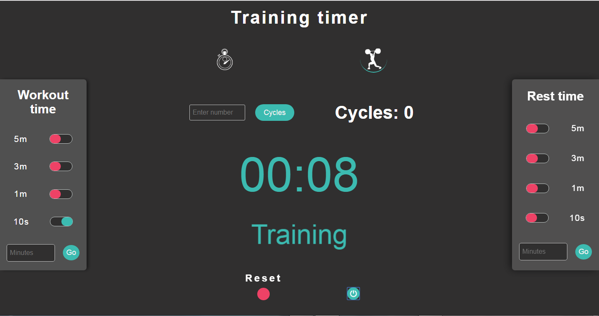

# Training-timer-and-chronometer

My first javascript project !

- Mode chronometer
   * You can start, stop, restart and reset the chronometer.

- Mode training
   * You can configure how many training cycles you need.
   * You can set rest time and work time.
   * Alert sound at the end of a cycle.
   
   
You can see how it works here https://trainingtimerapp.netlify.com

          
